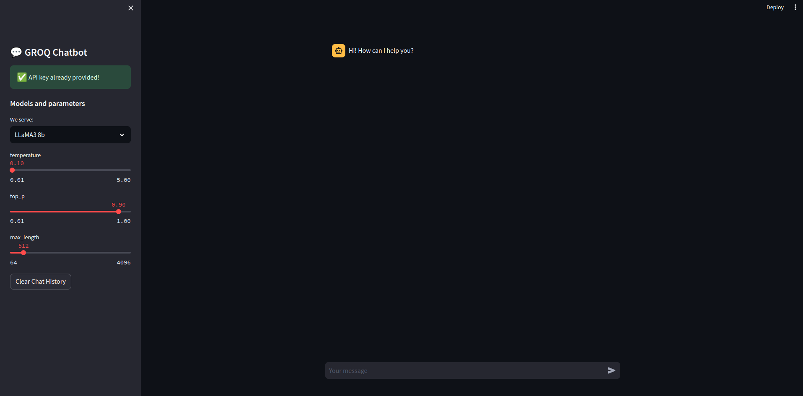

# GroqChatbot-on-Colab


## Introduction
The potential of AI to create truly intelligent chatbots has always fascinated me. Groq's specialized AI processors offered a unique opportunity to push these boundaries. This blog chronicles my journey building a chatbot using Groq's API, crafting a user-friendly interface with Streamlit, and deploying it using Ngrok and Google Colab, making it accessible to everyone.

## Feature

+ Utlize a wide range of LLMs, including Llama-3, Mixtral, etc. 
+ In-memory converstaion with the friendly chatbot that is profiled by a persona promptining technique. 
+ Utilize the powerful machine that Colab provides.  

## Usage
First and foremost, we obtain API keys from Groq and Ngrok: 

1. Groq: [https://console.groq.com/keys](https://console.groq.com/keys)
2. Ngrok: [https://dashboard.ngrok.com/get-started/your-authtoken](https://dashboard.ngrok.com/get-started/your-authtoken)

### Run local

1. First, you clone the project to your local machine and install required libraries: 

```
git clone https://github.com/What-s-behind/GroqChatbot-on-Colab.git
cd /GroqChatbot-on-Colab
pip install -r requirements.txt
```

2. Setup `.env` file. To be honest, you have 2 choices: you set the `GROQ_API_KEY` so that your users do not need to, or you let them type their own api key. If you prefre the first choice, create a `.env` file and put the key following this format. 

```Python
# .env file

GROQ_API_KEY="GROQ_API_KEY"
```
I leave an illustration in `.env.example`

3. Run the app 

```
streamlit run app.py
```

### Run notebooks

For those who want to use the app on Colab. You go to colab and upload the Jupyter notebook that you can see from the directory. Remember to initialize all necessary API keys from Colab's Secret zone.

**Note:** I've also repaired a simple HTML/CSS/Javascript demo at the `/app`. You can setup the `API_KEY` in the `script.js` file and run by starting the `Live` server in `VSCode`. 

## Gallery

When you success establishing all steps. Here is the result



## Contact

+ **Gmail**: minh.leduc.0210@gmail.com
+ **LinkedIn**: https://www.linkedin.com/in/minh-le-duc-a62863172/